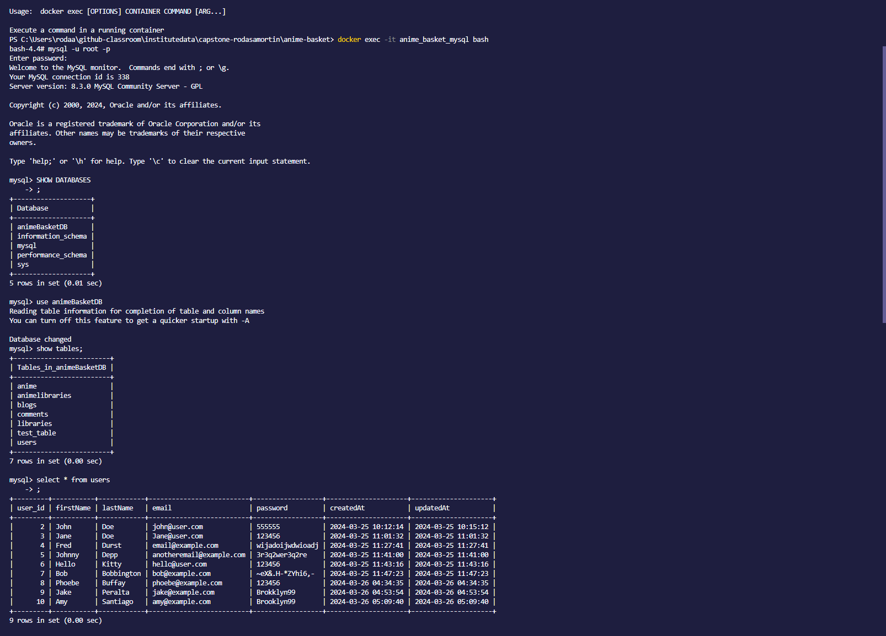
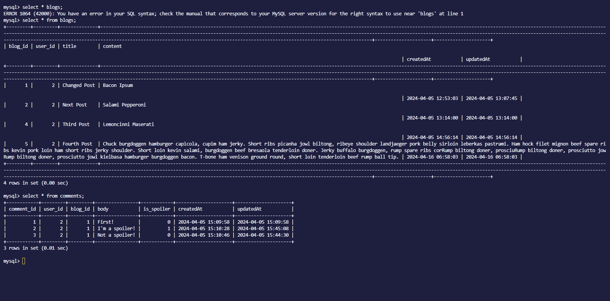
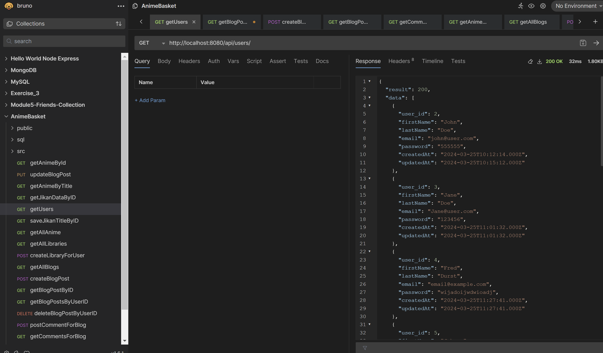
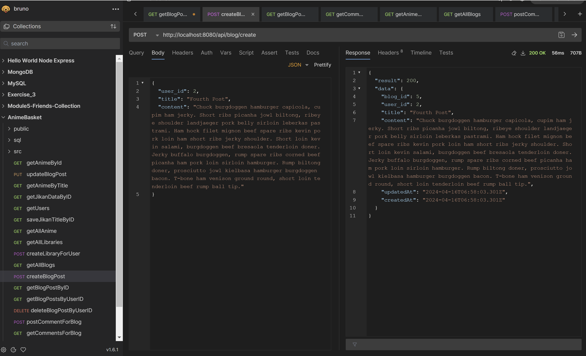
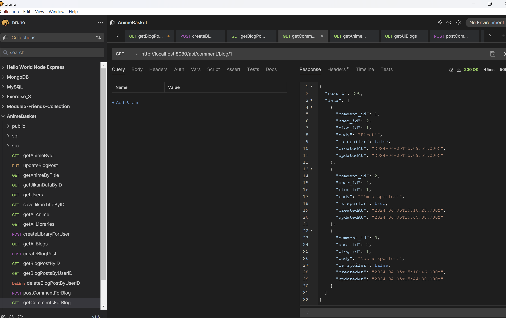
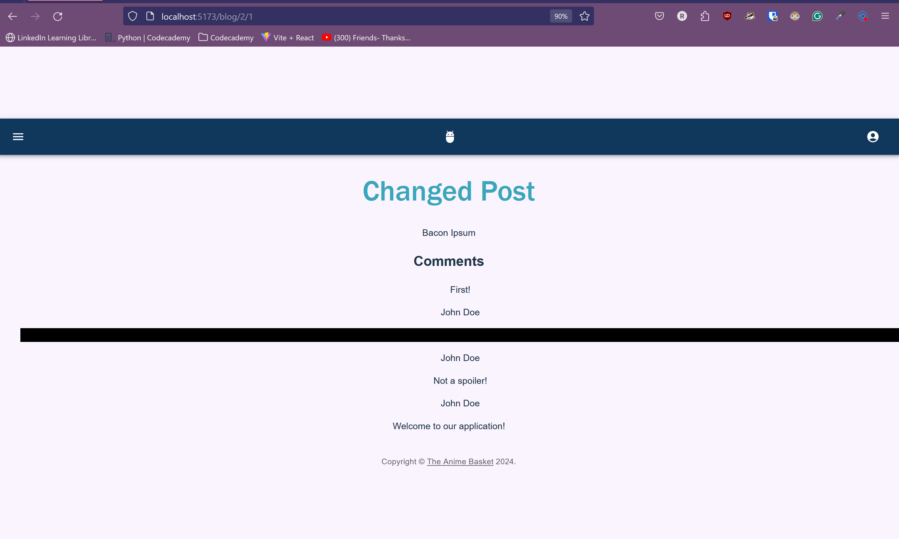

# Anime Basket #

**_Discover Your Next Anime Adventure: Where Spoilers Dare Not Tread!_**

## <u> I. Introduction </u> ##

### A. Purpose ###

Anime communities have thrived on website forums, vibrant hubs where fans passionately engage with their favorite content. Yet, navigating the tricky terrain of spoilers has remained a consistent challenge over the years.

Our primary goal is to create a welcoming and secure environment that fosters vibrant discussions among anime fans and their friends, with a particular focus on minimizing spoilers. By integrating spoiler tags in comments and discussions, we ensure that our community remains inclusive and healthy. This feature allows avid viewers to freely discuss the latest episodes, while protecting the viewing experience for those who may be catching up.

### B. Industry/ domain ###

The primary domain of this project is the **entertainment** industry, specifically **focusing on anime streaming and fan engagement.** This sector is currently thriving but faces challenges in spoiler management. 

The anime industry's value chain encompasses content creation, licensing, distribution, merchandising, and fan engagement, with key concepts including simulcasting, fan subbing, anime seasons, and spoiler management techniques.

Additionally, the project's relevance extends beyond anime, offering valuable insights and applications to other industries such as film, television, gaming, and literature, where managing spoilers and enhancing community engagement are equally critical.

### C. Stakeholders ###

 Several key stakeholders are directly involved or affected by the development and operation of the software. Here’s a detailed breakdown of these stakeholders, why they would care about the software, and their expectations:

 * _Users (Anime Viewers)_
    * _Why they care:_ Users are central to the website's purpose. They care about the software because it provides a platform to track, share, and discuss anime without the risk of encountering spoilers.

    * _Expectations:_ Users expect a user-friendly, reliable, and engaging platform that effectively blocks or hides spoilers, offers comprehensive tracking features, and fosters community interaction through comments and shared lists.

* _Developers_
    * _Why they care:_ These stakeholders are involved in the design, development, and ongoing technical support of the website. Their primary concern is the technical prowess and innovation of the software.

    * _Expectations:_ Developers look for a software architecture that is maintainable, scalable, and flexible for future enhancements. They expect a clear roadmap for development and efficient tools for deploying updates and fixes.

* _Content Creators (Animer Reviewers, Bloggers)_
    * _Why they care:_ Content creators use the platform to build an audience and share their insights on anime. They rely on the website to connect with like-minded viewers and to gain visibility in the anime community.

    * _Expectations:_ They expect the platform to provide features that enhance their content's visibility, such as featured reviews or integration with social media platforms. Additionally, they need tools to protect their content from being spoiled for other users.

## <u> II. Product Description </u> ##

### A. Architectural Diagram ###

 
 

 ### B. User Stories ###

 As an anime' viewer, I've had my fair share of frustrations with spoilers and non-customisable list of the shows that I want to watch. I've honed in on the _three pain points_ I consistently encounter when visiting anime websites.

To ensure top-notch quality, scalability, and seamless maintenance, I'm taking a targeted approach by addressing each pain point with one distinct feature and its corresponding design. 

<code style = "color : yellow"> <b>1</b> Pain Point : <b>1</b> Feature : <b>1</b> Design</code>
  

*** Three Pain Points - Feature ***

1. Spoilers -> Spoiler tag in the comment section
2. Limited sharing with Friends -> Privacy / Friend request (Keep spoil-mongers away!)
3. Customised Anime List -> Minimalist design (Animelist websites have superlative lists in general.)

### C. User Flow / Wire frame Design ###

_PS: This is the **INITIAL** design_
 

The anime list filter on the main page is accessible to everyone, allowing users to browse and refine their selections with ease. However, for those looking to engage more deeply—such as reading, creating, and commenting on blogs—a quick sign-up or login is required. This setup ensures full access to our interactive features for registered users.

### D. Features ###

* User Account - Sign in or sign up
* Anime Search Bar - To filter anime' choices (Jikan API)
* Blog
* Comments
* Spoiler Feature

### E. Tech Stack ###

I applied the MVC structure applied in different paths.

_Frontend:_

-**HTML, CSS, JavaScript:** Main usage for UI
-**React.js:** jS library for user interfaces
-**Material UI:** library of React components to implement design system in my app.
-**Jikan API:** Anime list API. The documentation relied heavily on its documentation.

_Backend:_

  - **Node.js:** JavaScript runtime environment.
  - **Express.js:** Node.js web app framework
  - **MySQL:** Database management system.
  - **Bruno:** API development and testing tool.
  - **Docker:** Cointainer for packaging, distributing, and running applications.

### F. Testing ###

_Backend Testing_

- **Bruno**: used to test the connection between data import and export to and from the database (server and web database) — to ensure data integrity and functionality.
- **Docker - MySQL**: To check database - server - API connection.

 
 

_Frontend Testing_

-**Browser Dev Tools**- To inspect elements, check network requests, and debugging.
-**Console**- To log and debug jS code.

 
 

 
 

_Third Party API Testing_

-**Jikan API** - Used its documentation as a basis on how the desired/requested data will be rendered. 
               - Used Bruno, Docker, MySQL to ensure data flow.

 
 

